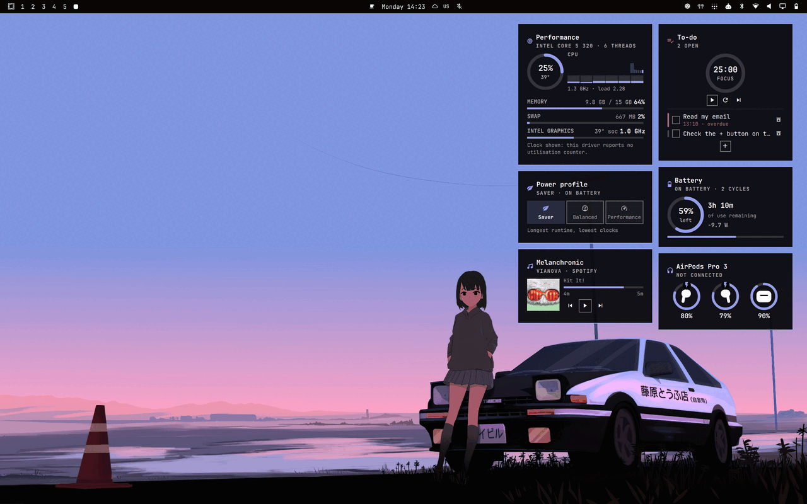
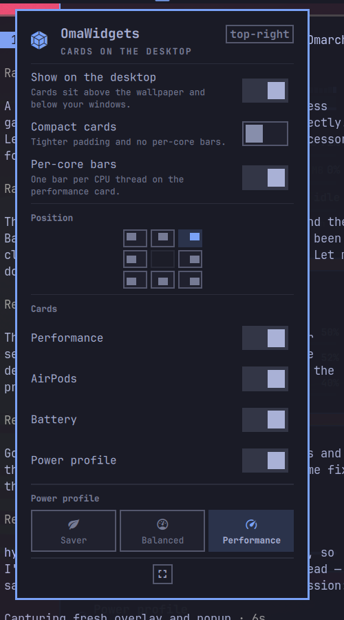

<h1 align="center">OmaWidgets</h1>

<p align="center">
  Desktop widget cards for Omarchy, in the spirit of the macOS desktop.<br>
  CPU, memory and GPU. AirPods battery. Battery status. Power profile, one click.
</p>

<p align="center">
  
</p>

<p align="center">
  <em>Every colour, border, corner radius and type size comes from your active Omarchy theme.<br>
  Switch themes and the cards switch with the rest of the shell, in the same frame.</em>
</p>

## Two ways to read them

**On the desktop.** The cards sit on a Wayland `bottom` layer: above the wallpaper,
below every application window. They are there when you look at the desktop and
out of the way when you are working. The window is sized to the cards and
anchored to one corner, so the rest of your wallpaper keeps its own
double-click-to-change-background behaviour.

**As an overlay.** The same cards, side by side on a dimmed full-screen surface,
summoned by a keybind and dismissed with `Escape`. One layout, one set of
readings, two ways to look at them.

<p align="center">
  
</p>

## The cards

### Performance

A gauge for CPU load with the package temperature under it, a strip of recent
history, and one bar per thread. Then memory, swap when any is in use, and the
GPU.

The GPU row is where hardware honesty matters. The three driver families expose
completely different things:

| | utilisation | temperature | clock | VRAM |
|---|---|---|---|---|
| **amdgpu** | `gpu_busy_percent` | own hwmon sensor | hwmon | `mem_info_vram_*` |
| **nvidia** | `nvidia-smi` | `nvidia-smi` | `nvidia-smi` | `nvidia-smi` |
| **i915 / xe** | *none available* | shares the CPU package sensor | `gt_act_freq` | shared with system RAM |

Intel exposes no busy counter in sysfs. `intel_gpu_top` can produce one, but
only with `CAP_PERFMON` or a relaxed `perf_event_paranoid` — a privilege no
shell plugin should ask you to grant. So an Intel card shows the clock it is
actually running at, marks a shared temperature sensor as `soc`, and says in
one line why there is no percentage. It does not invent one.

### AirPods

Per-pod and case battery, charging and in-ear hints, the listening mode and the
case lid, read from the status file the
[librepods](https://github.com/kavishdevar/librepods) daemon publishes at
`$XDG_STATE_HOME/librepods/status.json` — the same file the
[AirPods plugin](https://github.com/thisisgm/omarchy-pods) reads.

**This card displays and does not command.** Listening mode, ear detection,
Conversation Awareness and the rest belong to `io.github.thisisgm.omapods`,
which owns the write path to the daemon. Two panels racing each other's
optimistic writes for one device would be worse than one panel that reports.

The card hides itself when nothing is reporting, so a machine with no AirPods
does not carry a permanent empty card. There is no polling: the daemon rewrites
the file on change and the plugin watches it.

### Battery

Level, what the battery is doing, and how long that leaves — the answer to "how
long have I got" as the headline, with the charge or draw rate, cell health and
cycle count underneath. Everything comes from UPower, which is signal-driven,
so this card costs nothing while it sits there.

### Power profile

Saver, Balanced and Performance as one segmented control. Only the profiles the
running `power-profiles-daemon` actually reported get a segment; a machine
without it shows a line saying so rather than three buttons that would do
nothing.

Switching goes through Omarchy's own `omarchy-powerprofiles-set`, so your choice
is remembered per power source exactly as the stock power panel remembers it —
set Performance on AC and Saver on battery, and Omarchy restores each one when
you plug and unplug.

## Install

```bash
omarchy plugin add https://github.com/fabandrade88/omawidgets.git
omarchy plugin enable io.github.fabandrade88.omawidgets --section right
```

Plugins land disabled so you can read the code before you run it. That is worth
doing — see [Running someone else's code](#running-someone-elses-code).

To remove it completely:

```bash
omarchy plugin remove io.github.fabandrade88.omawidgets
```

## Using it

A bar icon appears on the right of your bar. It is dimmed while the desktop
cards are hidden.

| | |
|---|---|
| **Left click** | Open the settings popup |
| **Right click** | Show or hide the desktop cards |
| **Middle click** | Summon the overlay |
| **← →** in the popup | Step through the power profiles |
| **Escape** | Close the popup or the overlay |

<p align="center">
  
</p>

The popup holds everything: the desktop toggle, compact mode, per-core bars, a
3×3 picker for where the cards sit, which cards to show, and the power profile.
Changes are written to `~/.config/omarchy/shell.json` as you make them.

### Keybindings

Add to `~/.config/hypr/bindings.conf`:

```bash
# Summon the overlay
bindd = SUPER, W, Widgets overlay, exec, omarchy-shell omawidgets toggle

# Show or hide the desktop cards without opening anything
bindd = SUPER SHIFT, W, Toggle desktop widgets, exec, omarchy-shell omawidgets-bar toggleDesktop
```

### IPC

```bash
omarchy-shell omawidgets toggle              # summon or dismiss the overlay
omarchy-shell omawidgets refresh             # re-probe hardware and re-read everything
omarchy-shell omawidgets profile             # print the active power profile
omarchy-shell omawidgets setProfile balanced # set it (rejects anything else)
omarchy-shell omawidgets-bar toggleDesktop   # show or hide the desktop cards
omarchy-shell omawidgets-bar position top-left   # move the cards; prints where they ended up
```

`position` takes any of the eight names in the table below. An unknown one
leaves the cards where they are and prints the position they are still in.

## Settings

Everything lives inline on the plugin's entry in `~/.config/omarchy/shell.json`.
The popup writes the same fields, so hand-editing and clicking are the same
thing. Every value is clamped and unknown values fall back to the default, so a
typo costs you one setting rather than the widget.

| Key | Default | |
|---|---|---|
| `desktop` | `true` | Draw the cards on the desktop |
| `position` | `top-right` | `top-left`, `top-center`, `top-right`, `middle-left`, `middle-right`, `bottom-left`, `bottom-center`, `bottom-right`. Margins are measured from the usable area, so the cards clear the bar whichever edge it is on |
| `cards` | all four | Any of `system`, `pods`, `battery`, `power`, in the order you want them |
| `columns` | `1` | 1–4 on the desktop. The overlay always spreads them across one row |
| `cardWidth` | `268` | 180–520 pixels |
| `spacing` | `10` | 0–48 pixels between cards |
| `marginX` / `marginY` | `28` / `20` | Distance from the screen edges |
| `opacity` | `0.92` | 0.2–1. The colour itself comes from the theme |
| `compact` | `false` | Tighter padding, no per-core bars |
| `showCoreBars` | `true` | One bar per CPU thread |
| `intervalMs` | `2000` | 500–60000. Sampling stops entirely while nothing is on screen |
| `monitor` | `""` | A connector name such as `eDP-1`. Empty means every monitor |
| `hidePodsWhenAbsent` | `true` | Drop the AirPods card when no device is reporting |

```json
{
  "id": "io.github.fabandrade88.omawidgets",
  "position": "bottom-right",
  "columns": 2,
  "cards": ["system", "battery"],
  "intervalMs": 1000
}
```

## What it costs

The sampling loop **spawns no processes**. Quickshell's `FileView` reads
`/proc/stat`, `/proc/meminfo`, `/proc/loadavg` and the sysfs nodes directly, and
each file reports its contents back asynchronously as it loads — so nothing
blocks the UI thread and no reading is ever taken from a stale cache.

Three things follow from that:

- **Nothing visible, nothing running.** Every timer is gated on a surface
  actually showing a card. Turn the desktop cards off and the plugin does
  nothing at all until you summon it.
- **One instance, one set of timers.** The bar widget, the desktop cards and the
  overlay all read from a single service, however many of them are open.
- **Event-driven where possible.** AirPods state arrives by inotify, battery by
  UPower signals, and the power profile is re-read only on an AC transition or
  our own write. None of it is polled.

The exceptions are stated plainly: one `bash` invocation at startup to discover
where this machine keeps its sensors, one `busctl` call (about 6ms) when the
power profile could have changed, and — on NVIDIA only, and only while a card is
on screen — `nvidia-smi`, because NVIDIA publishes nothing in sysfs.

## Running someone else's code

Omarchy plugins run unsandboxed inside your long-lived shell process, with your
permissions. That is true of this one too, so here is exactly what it does.

**It reads.** `/proc/stat`, `/proc/meminfo`, `/proc/loadavg`, hwmon and thermal
sensors, the GPU's sysfs nodes, the battery's cycle count, and the librepods
status file. All of it read-only.

**It writes one thing.** The power profile, and only through Omarchy's own
`omarchy-powerprofiles-set`. The profile name passes two gates before it reaches
an argument vector: it must be one of the three names `power-profiles-daemon`
defines, and it must appear in the list the running daemon reported for your
machine. Anything else yields an empty string and no command is built.
[`tests/input.test.js`](tests/input.test.js) asserts this against command
substitutions, shell separators, newlines, flags and case variants.

**It asks for no privileges.** No sudo, no polkit, no capabilities, no
`perf_event` access, no setuid helper. If a reading needs a privilege, the
plugin does without the reading.

**It talks to no network.** There is no HTTP client in the codebase.

**It treats every input as hostile.** Everything it reads is text written by
another process — a kernel that renamed a field, a daemon caught mid-write, a
`shell.json` edited by hand, an AirPods name chosen on someone's phone. Each one
goes through a typed parser that clamps ranges, strips control characters, caps
lengths, and falls back rather than throwing. Device names are rendered as
`Text.PlainText` and never interpreted.

**Its one helper script takes no arguments.** `scripts/omawidgets-probe` runs
once per session to find where your sensors live. It accepts no input, pins
`PATH`, resolves every path it reports and refuses any that does not land inside
`/sys` or `/proc`. The plugin checks that again before opening one.

## Hacking on it

```bash
git clone https://github.com/fabandrade88/omawidgets.git
cd omawidgets
./tests/run.sh              # manifest, model, QML, and the probe on this machine
./scripts/omawidgets-dev-install
omarchy plugin enable io.github.fabandrade88.omawidgets --section right
```

Saving a file under `~/.config/omarchy/plugins/` hot-reloads it. Run
`./scripts/omawidgets-dev-install` again to push your changes there, or
`omarchy-shell shell rescanPlugins` to force a reload.

```bash
qs log -p "${OMARCHY_PATH:-/usr/share/omarchy}/shell" --tail 40
```

### How it is put together

Everything that parses or decides lives in `model/` as plain JavaScript with no
QML imports, so `node` runs the same source the shell does. Everything in QML is
either a service that reads files or a component that draws.

```
manifest.json        three kinds: a service, a bar widget, an overlay
Service.qml          the one long-lived instance: owns every sampler and the desktop surface
BarWidget.qml        the bar icon, the settings popup, and the only write path to shell.json
Overlay.qml          the summoned surface

SystemService.qml    CPU and memory, on a gated timer
GpuService.qml       GPU, from sysfs or nvidia-smi
PodsService.qml      AirPods, from an inotify watch — no timer
PowerService.qml     UPower, and the power profile
HardwareProbe.qml    runs scripts/omawidgets-probe once per session

DesktopSurface.qml   layer-shell windows on WlrLayer.Bottom, one per screen
OverlaySurface.qml   the dimmed full-screen surface
CardStack.qml        the arrangement both surfaces share

SystemCard.qml  PodsCard.qml  BatteryCard.qml  PowerCard.qml
Card.qml  MetricRow.qml  MeterBar.qml  RingGauge.qml  HistoryGraph.qml
CoreBars.qml  PodPill.qml  ProfileSelector.qml  ToggleRow.qml  PositionGrid.qml

model/Sysfs.js       /proc and hwmon parsers
model/Gpu.js         one shape from three driver families
model/Pods.js        the librepods status file, defensively
model/Power.js       battery presentation, and the profile allowlist
model/Settings.js    normalisation, clamping, and desktop placement
model/Format.js      numbers and units
model/Series.js      bounded sample history
model/Probe.js       the probe's output, and the path allowlist

scripts/omawidgets-probe      one-shot sensor discovery, no arguments, read-only
scripts/omawidgets-probe-gpu  the GPU half of it, sourced rather than run
scripts/omawidgets-dev-install
```

Every source file is 200 lines or fewer, and `./tests/run.sh` fails if one
stops being: a file that outgrows the limit is doing more than one job.

### Tests

```bash
./tests/run.sh
```

- **`model.test.js`** — formatting, `/proc` parsing, GPU normalisation across all
  three driver families, bounded history.
- **`input.test.js`** — the paths where being wrong has consequences: the power
  profile allowlist, truncated and hostile librepods JSON, hand-edited settings.
- **`glyphs.test.js`** — every Nerd Font glyph in the source, against the font
  the bar actually uses. It catches both a codepoint the font lacks and a
  malformed surrogate pair, which is not one character at all and looks like a
  styling problem rather than the typo it is.

`run.sh` also validates the manifest against the shell's own validator, lints
the QML, runs `shellcheck` over the scripts when it is installed, runs the
hardware probe on the machine you are sitting at, and enforces the line limit.

## Credits

Built on [Quickshell](https://quickshell.org/) and the
[Omarchy](https://omarchy.org) shell's plugin API, whose `Color`, `Style` and
`Border` singletons do all the theming here. AirPods readings come from the
[librepods](https://github.com/kavishdevar/librepods) daemon by way of
[omarchy-pods](https://github.com/thisisgm/omarchy-pods).

## License

MIT. See [LICENSE](LICENSE).
