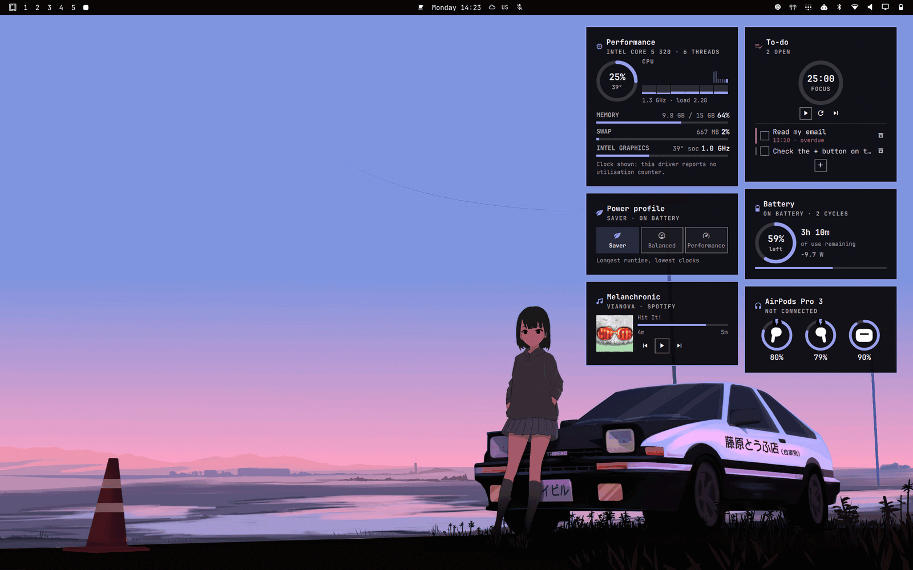
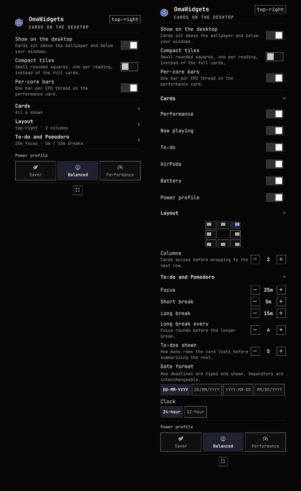
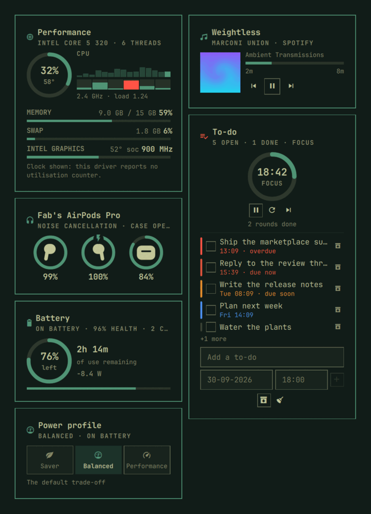

<h1 align="center">OmaWidgets</h1>

<p align="center">
  Desktop widget cards for Omarchy, in the spirit of the macOS desktop.<br>
  Performance, now playing, to-dos with a Pomodoro clock, AirPods, battery and power profile —<br>
  on your wallpaper, under your windows, in your theme.
</p>

<p align="center">
  
</p>

## Install

```bash
omarchy plugin add https://github.com/fabandrade88/OmaWidgets.git
omarchy plugin enable io.github.fabandrade88.omawidgets --section right
```

A bar icon appears: **left click** for settings, **right click** to show or hide
the cards, **middle click** for the overlay.

```bash
omarchy plugin update io.github.fabandrade88.omawidgets    # pull the latest
omarchy plugin disable io.github.fabandrade88.omawidgets   # stop running it
omarchy plugin remove io.github.fabandrade88.omawidgets    # uninstall
```

> `disable` removes the plugin's bar entry, and Omarchy keeps a widget's
> settings on that entry — so enabling again starts from the defaults. To put
> the cards away without losing your setup, right-click the bar icon.

## Requirements

| | |
|---|---|
| **Omarchy 4.0 "Quattro" or newer** | The plugin API and the Quickshell-based bar |
| **A Nerd Font** | Omarchy's own bar font supplies every icon |
| `upower` | Battery card. Ships with Omarchy |
| `power-profiles-daemon` | Power profile card. Ships with Omarchy |
| [librepods](https://github.com/kavishdevar/librepods) | *Optional.* AirPods card only. It reads the daemon's own status file, so the [AirPods plugin](https://github.com/thisisgm/omarchy-pods) is **not** required — with neither installed, that card simply hides itself and everything else works |
| `nvidia-smi` | *Optional.* NVIDIA GPU readings. AMD and Intel are read from sysfs |

Nothing else at runtime: readings come from `/proc`, `/sys`, UPower and MPRIS,
and nothing is polled that a signal can report.

## Features

| | |
|---|---|
| **Performance** | CPU load, temperature, per-thread bars and recent history; memory and swap; GPU load, temperature and clock — with the honest answer when a driver exposes none |
| **Now playing** | Any MPRIS player, cover art, and transport that dims what the source cannot do |
| **To-do + Pomodoro** | Configurable focus and break rounds with an alarm, and a list coloured by how close each deadline is |
| **AirPods** | Per-pod and case battery, charging, in-ear, listening mode and case lid |
| **Battery** | Level, state, time remaining, draw rate, health and cycle count |
| **Power profile** | Saver, Balanced, Performance in one click, remembered per power source |
| **Two surfaces** | Cards on the desktop below your windows, and the same cards on a summoned overlay |
| **Compact mode** | The whole set as small rounded tiles, one reading each |
| **Arranging** | Click to select, drag to reorder, hover for an X to hide — or from a keybind |
| **Themed** | Every colour, border, corner and type size from the active Omarchy theme |
| **Idle-free** | Nothing on screen means no timers: measurably the same as not installing it |

## Screenshots

<table>
  <tr>
    <td align="center"><br><em>The cards</em></td>
    <td align="center"><br><em>Compact tiles</em></td>
    <td align="center"><br><em>To-do and Pomodoro</em></td>
  </tr>
</table>

<p align="center">
  <br>
  <em>The overlay: the same cards, summoned over whatever you were doing.</em>
</p>

<table>
  <tr>
    <td align="center"><br><em>Settings, folded and open</em></td>
    <td align="center"><br><em>One theme switch later</em></td>
  </tr>
</table>

## Using it

**Arrange them.** Click a widget to select it, drag it to reorder, hover it for
an X that hides it. Hiding also switches it off in the popup, which is where you
turn it back on.

**Configure them.** The popup holds the desktop toggle, compact mode, per-core
bars, the power profile, and three folding sections: **Cards**, **Layout**
(position, columns, tile size) and **To-do and Pomodoro** (durations, rows, and
the date and clock formats — `DD-MM-YYYY` and 24-hour by default). Changes are
written to `~/.config/omarchy/shell.json` as you make them.

**Script them.** Everything has an IPC verb:

```bash
omarchy-shell omawidgets toggle          # summon or dismiss the overlay
omarchy-shell omawidgets nowPlaying      # "playing<TAB>title<TAB>artist"
omarchy-shell omawidgets addTodo "Ship the plugin"
omarchy-shell omawidgets pomodoro        # "running  focus  18:42"
omarchy-shell omawidgets-bar toggleDesktop
```

## Documentation

| | |
|---|---|
| [The cards, in detail](docs/CARDS.md) | What each card reads, and why it is drawn the way it is |
| [Settings, arranging and IPC](docs/SETTINGS.md) | Every setting, keybinding and IPC verb |
| [What it costs, and what it can reach](docs/SECURITY.md) | Measured CPU cost, and every file, process and permission it touches |
| [Hacking on it](docs/DEVELOPMENT.md) | How the source is laid out, and the test suite |
| [Changelog](CHANGELOG.md) | What changed, and why |

## Credits

Built on [Quickshell](https://quickshell.org/) and the
[Omarchy](https://omarchy.org) shell's plugin API, whose `Color`, `Style` and
`Border` singletons do all the theming here. AirPods readings come from the
[librepods](https://github.com/kavishdevar/librepods) daemon by way of
[omarchy-pods](https://github.com/thisisgm/omarchy-pods).

## License

MIT. See [LICENSE](LICENSE).

---

<p align="center"><sub>Developed with the support of Claude.</sub></p>
