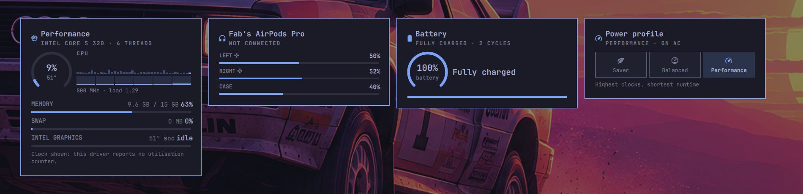
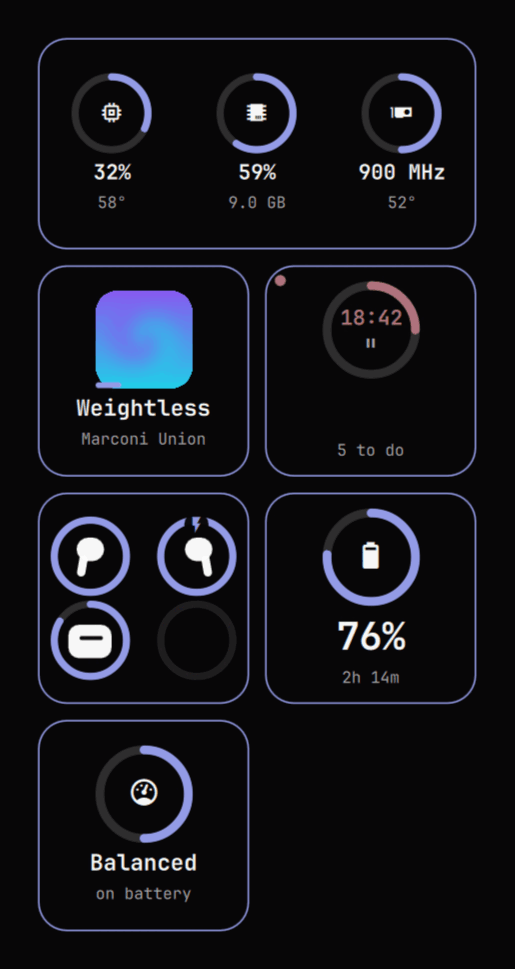
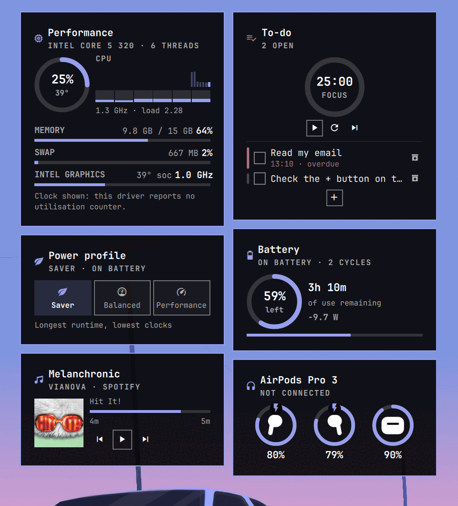
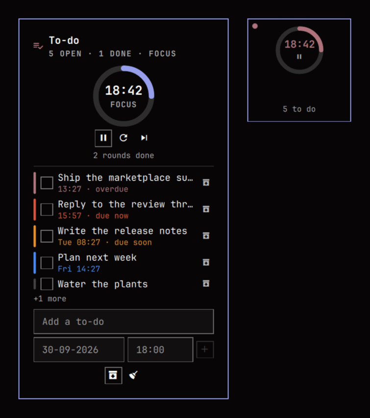

# The cards, in detail

[← README](../README.md)

## Two ways to read them

**On the desktop.** The cards sit on a Wayland `bottom` layer: above the wallpaper,
below every application window. They are there when you look at the desktop and
out of the way when you are working. The window is sized to the cards and
anchored to one corner, so the rest of your wallpaper keeps its own
double-click-to-change-background behaviour.

**As an overlay.** The same cards, side by side on a dimmed full-screen surface,
summoned by a keybind and dismissed with `Escape`. One layout, one set of
readings, two ways to look at them.

  

## Compact mode

Compact is a different layout, not a smaller one. Each widget becomes a rounded
square: a ring with its mark inside and the reading underneath, the way iOS and
macOS draw a battery widget.

Performance keeps its three readings together in one wide tile — CPU, memory and
GPU are the three halves of "what is this machine doing", and reading them as
three squares scattered through a grid is worse than reading them side by side.
The AirPods tile packs its rings into a two-by-two. The media tile puts the cover
where the others put their ring, with the track underneath and progress along the
bottom of the art.

  

Tile corners are rounded from `tileRadius`, independently of the theme's own
corner radius: a theme with square corners still wants its small tiles rounded,
and that softness is the whole visual idea. Everything else — colour, border,
type — still comes from the theme.

The columns and tile size are in the bar popup, and compact defaults to two
columns because a single column of small squares wastes the space a full card
needs. The summoned overlay always shows the full cards: it has the whole
screen, so there is nothing to compact.

## The cards

  

### Performance

A gauge for CPU load with the package temperature under it, a strip of recent
history, and one bar per thread. Then memory, swap when any is in use, and the
GPU.

The GPU row is where hardware honesty matters. The three driver families expose
completely different things:

| | utilisation | temperature | clock | VRAM |
|---|---|---|---|---|
| **amdgpu** | `gpu_busy_percent` | own hwmon sensor | hwmon | `mem_info_vram_*` |
| **nvidia** | `nvidia-smi` | `nvidia-smi` | `nvidia-smi` | `nvidia-smi` |
| **i915 / xe** | *none available* | shares the CPU package sensor | `gt_act_freq` | shared with system RAM |

Intel exposes no busy counter in sysfs. `intel_gpu_top` can produce one, but
only with `CAP_PERFMON` or a relaxed `perf_event_paranoid` — a privilege no
shell plugin should ask you to grant. So an Intel card shows the clock it is
actually running at, marks a shared temperature sensor as `soc`, and says in
one line why there is no percentage. It does not invent one.

### Now playing

Title, artist, album, elapsed and remaining, and the transport: previous,
play/pause, next. It follows whatever MPRIS player is actually playing —
Spotify, a browser tab, mpv, anything that speaks the protocol — and
`preferredPlayer` pins it to one by name when you would rather it did not
wander.

Each button is enabled from the player's own capability flags, so a source that
cannot skip — a live stream, most podcasts — shows the button dimmed and inert
rather than pretending. Album art fills the tile in compact mode and sits beside
the track on the full card.

Control is native: Quickshell speaks MPRIS directly, so skipping a track costs
one D-Bus call, not a subprocess.

### To-do, with a Pomodoro clock

The two are one card because they are one activity: you run a focus round *at*
something. The clock is on top — a ring that fills as the phase runs, because a
ring draining to nothing looks like a failure state at a glance — and the list
is under it, sorted by how nearly late each item is.

Focus is 25 minutes, the short break 5, the long break 15, and a long break
arrives every fourth focus round. All four are settings, because that is a
convention rather than a law. When a phase ends the next one starts on its own
and an alarm sounds: a chime from the freedesktop sound theme, and a desktop
notification. A phase you skip into waits for you to start it.

Each to-do can have a deadline, and its colour says how close that is:

| | |
|---|---|
| **Blue** | More than a day out |
| **Orange** | Within a day |
| **Red** | Within two hours, or past it |
| **Green** | Done |

These four are the only fixed colours in the plugin — everything else is themed.
Urgency is information, and information that changed meaning with the wallpaper
would be a trap. The words next to the stripe say the same thing, so the colour
is never the only signal. The card's own accent follows the most pressing
deadline in it, so a glance at the desktop says whether anything needs you.

  

Done to-dos can be archived one at a time or all at once, and brought back from
the archive later. The list lives in
`$XDG_STATE_HOME/omawidgets/todos.json` — see
[Running someone else's code](SECURITY.md#running-someone-elses-code).

Adding a to-do needs a keyboard, and the desktop layer refuses one by default —
that is what stops a desktop widget stealing keys from the window you are working
in. So the desktop card has a **+** button: pressing it opens the composer *and*
asks the compositor for the keyboard, and closing it gives the keyboard straight
back. The overlay and the bar popup already have one, so there the composer is
simply there.

Type the to-do, and optionally a date and a time. Leave the time out and it is
due at the end of that day; leave the date out and it has no deadline at all.
`Escape` closes the composer, and on the desktop adding one closes it too — the
card goes back to its **+** and the keyboard goes back to your window.

Dates are **DD-MM-YYYY** and the clock is **24-hour** by default; `dateFormat`
and `timeFormat` change both, and the placeholders, the parsing and every
deadline shown on the card follow. Parsing is done by the plugin rather than by
Qt's locale parser, so what the field accepts follows the setting rather than
whatever locale the session happens to have — and separators are interchangeable,
so `30/09/2026` is accepted whichever one the format asked for. `6pm`, `18:00`,
`1830` and `18.30` all read as six in the evening.

### AirPods

A ring per part with its mark inside and the level underneath — the left pod, the
right pod and the case — so the pair and the case are read side by side rather
than as three stacked bars. Charging breaks the ring at twelve o'clock. In compact
mode the same rings pack into a two-by-two square.

The marks are drawn here rather than taken from a font or from a vendor's
artwork. No Nerd Font glyph is an AirPod, and the nearest candidates say "audio"
without saying *which* bud — the one thing these marks exist to say. The
[omarchy-pods](https://github.com/thisisgm/omarchy-pods) plugin solves it with
Apple's own product outlines lifted from apple.com, which is a reasonable choice
for a plugin but not one worth copying into a separately published one. These are
original silhouettes: one path each, so the head, the ear tip and the stem union
cleanly instead of showing seams where overlapping rectangles meet, and the pair
is genuinely mirrored rather than one picture used twice. An AirPods Max has a
single battery and no case, so it gets one gauge and a headphone mark.

Per-pod and case battery, charging and in-ear hints, the listening mode and the
case lid, all read from the status file the
[librepods](https://github.com/kavishdevar/librepods) daemon publishes at
`$XDG_STATE_HOME/librepods/status.json` — the same file the
[AirPods plugin](https://github.com/thisisgm/omarchy-pods) reads.

**This card displays and does not command.** Listening mode, ear detection,
Conversation Awareness and the rest belong to `io.github.thisisgm.omapods`,
which owns the write path to the daemon. Two panels racing each other's
optimistic writes for one device would be worse than one panel that reports.

The card hides itself when nothing is reporting, so a machine with no AirPods
does not carry a permanent empty card. There is no polling: the daemon rewrites
the file on change and the plugin watches it.

### Battery

Level, what the battery is doing, and how long that leaves — the answer to "how
long have I got" as the headline, with the charge or draw rate, cell health and
cycle count underneath. Everything comes from UPower, which is signal-driven,
so this card costs nothing while it sits there.

### Power profile

Saver, Balanced and Performance as one segmented control. Only the profiles the
running `power-profiles-daemon` actually reported get a segment; a machine
without it shows a line saying so rather than three buttons that would do
nothing.

The compact tile has one gesture, so tapping it cycles and wraps round: Saver,
Balanced, Performance, Saver again. The popup's arrow keys step and stop at the
ends instead, the way arrow keys on a slider do.

Switching goes through Omarchy's own `omarchy-powerprofiles-set`, so your choice
is remembered per power source exactly as the stock power panel remembers it —
set Performance on AC and Saver on battery, and Omarchy restores each one when
you plug and unplug.
